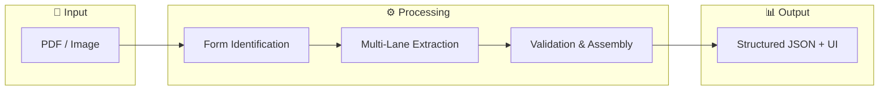
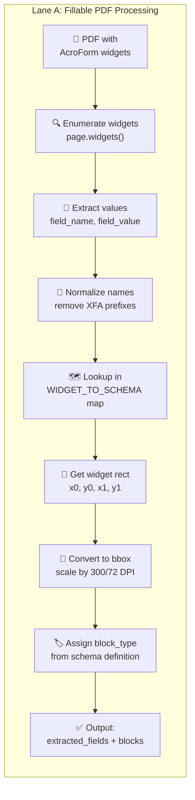
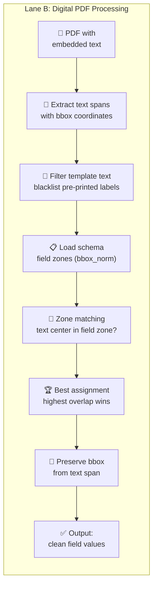
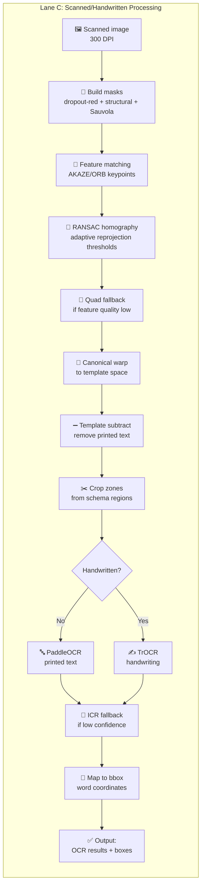
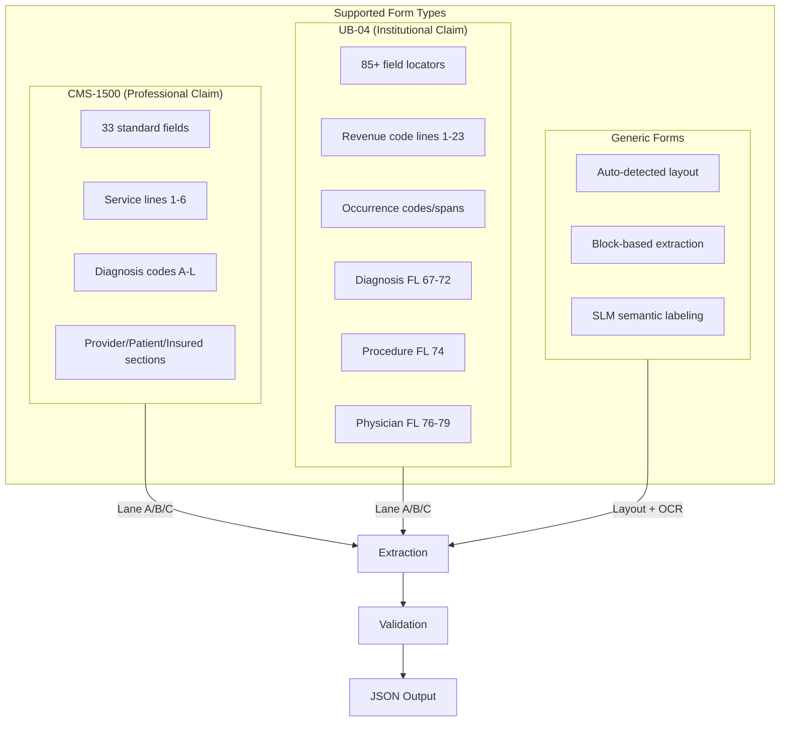
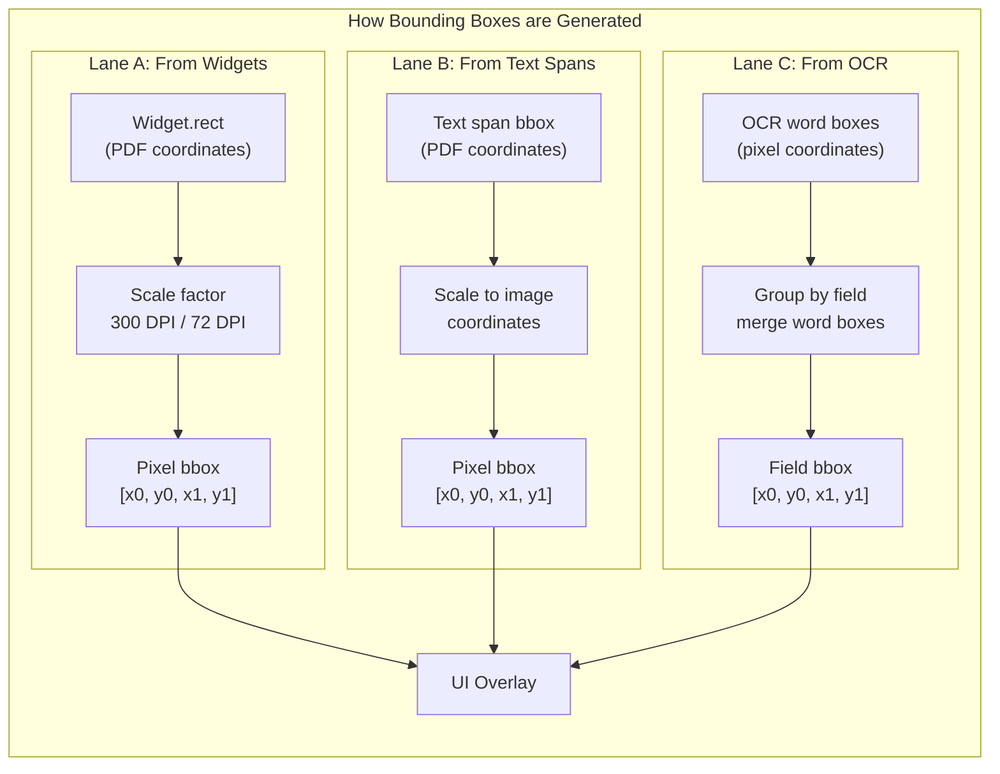

# Pipeline Overview, Methods, and Open Questions

This document summarizes the current pipeline architecture, the methods used so far,
the models in use, and open questions to communicate clearly with leadership.

---

## High-Level Architecture (Summary)

---

## Detailed Pipeline Architecture

```mermaid
flowchart TB
    %% ============================================================
    %% STAGE 1: DOCUMENT INGESTION
    %% ============================================================
    subgraph STAGE1["📥 STAGE 1: Document Ingestion"]
        A1["Input: PDF or Image file"]
        A2["Render to 300 DPI RGB array<br/>(PyMuPDF / PIL)"]
        A3["Extract metadata<br/>page count, dimensions"]
        A4["Check for embedded text layer<br/>(digital vs scanned)"]
        A5["Check for AcroForm widgets<br/>(fillable PDF fields)"]
        
        A1 --> A2 --> A3
        A3 --> A4
        A3 --> A5
    end
    
    %% ============================================================
    %% STAGE 2: FORM IDENTIFICATION
    %% ============================================================
    subgraph STAGE2["🔍 STAGE 2: Form Identification Agent"]
        B1["OCR top region<br/>(header text extraction)"]
        B2["Token matching<br/>CMS-1500, UB-04, HCFA keywords"]
        B3["Layout fingerprint analysis<br/>checkbox density, form structure"]
        B4["Confidence scoring<br/>combine text + layout signals"]
        B5{"Form Type<br/>Decision"}
        
        B1 --> B2 --> B4
        B3 --> B4
        B4 --> B5
    end
    
    A4 --> B1
    A5 --> B5
    
    B5 -->|"CMS-1500 / UB-04"| STAGE3
    B5 -->|"Generic Form"| STAGE4
    
    %% ============================================================
    %% STAGE 3: HEALTHCARE FORM PROCESSING (CMS-1500 / UB-04)
    %% ============================================================
    subgraph STAGE3["🏥 STAGE 3: Healthcare Form Processing"]
        
        C0{"PDF Type<br/>Detection"}
        
        %% ─────────────────────────────────────────────────────────
        %% LANE A: ACROFORM WIDGETS (Machine-Filled PDFs)
        %% ─────────────────────────────────────────────────────────
        subgraph LANEA["🅰️ LANE A: Widget Extraction (Fillable PDFs)"]
            LA1["Enumerate PDF widgets<br/>(PyMuPDF widget iterator)"]
            LA2["Extract field names + values<br/>from AcroForm dictionary"]
            LA3["Normalize XFA widget names<br/>remove prefixes, clean IDs"]
            LA4["Schema field mapping<br/>widget name → field ID lookup"]
            LA5["Spatial fallback matching<br/>bbox IoU for unmapped widgets"]
            LA6["Generate bounding boxes<br/>from widget rect coordinates"]
            LA7["Assign block types<br/>header, table_cell, form_field"]
            
            LA1 --> LA2 --> LA3 --> LA4
            LA4 --> LA5 --> LA6 --> LA7
        end
        
        %% ─────────────────────────────────────────────────────────
        %% LANE B: DIGITAL TEXT LAYER (Electronic PDFs)
        %% ─────────────────────────────────────────────────────────
        subgraph LANEB["🅱️ LANE B: Digital Text Layer (Non-fillable Digital PDFs)"]
            LB1["Extract text spans<br/>(PyMuPDF get_text with bbox)"]
            LB2["Filter template labels<br/>blacklist pre-printed text"]
            LB3["Load form schema<br/>field definitions + bbox_norm"]
            LB4["Zone-based matching<br/>text bbox ↔ schema zone overlap"]
            LB5["Unique assignment<br/>best match per schema field"]
            LB6["Generate bounding boxes<br/>from matched text spans"]
            LB7["Preserve original coordinates<br/>no OCR distortion"]
            
            LB1 --> LB2 --> LB3 --> LB4
            LB4 --> LB5 --> LB6 --> LB7
        end
        
        %% ─────────────────────────────────────────────────────────
        %% LANE C: SCANNED / HANDWRITTEN
        %% ─────────────────────────────────────────────────────────
        subgraph LANEC["🅲 LANE C: Scanned / Handwritten Forms"]
            LC1["Template Alignment<br/>dropout-red + structural masks"]
            LC2["Feature matching<br/>AKAZE/ORB keypoints (RANSAC)"]
            LC3["Quad fallback<br/>outer form boundary homography"]
            LC4["Canonical warp<br/>to template coordinate space"]
            LC5["Template subtraction<br/>remove pre-printed labels"]
            LC6["Zone-based OCR<br/>crop schema regions"]
            LC7["PaddleOCR for printed text"]
            LC8["TrOCR for handwriting"]
            LC9["ICR fallback<br/>if confidence < threshold"]
            LC10["Generate bounding boxes<br/>from OCR word coordinates"]
            
            LC1 --> LC2 --> LC3 --> LC4 --> LC5
            LC5 --> LC6
            LC6 --> LC7
            LC6 --> LC8
            LC7 --> LC9
            LC8 --> LC9
            LC9 --> LC10
        end
        
        C0 -->|"Widgets present<br/>(filled > 5)"| LANEA
        C0 -->|"Digital text layer<br/>(no widgets)"| LANEB
        C0 -->|"Scanned image<br/>(no text layer)"| LANEC
    end
    
    %% ============================================================
    %% STAGE 4: GENERAL FORM PROCESSING
    %% ============================================================
    subgraph STAGE4["📋 STAGE 4: General Form Processing"]
        D1["Layout Detection<br/>Detectron2 / PaddleDetection"]
        D2["Block classification<br/>Text, Table, Figure, Form Field"]
        D3["Block-wise OCR<br/>PaddleOCR + TrOCR"]
        D4["Generate bounding boxes<br/>from detected regions"]
        
        D1 --> D2 --> D3 --> D4
    end
    
    %% ============================================================
    %% STAGE 5: POST-PROCESSING AGENTS
    %% ============================================================
    subgraph STAGE5["🤖 STAGE 5: Intelligence Agents"]
        
        subgraph TEXTPROC["Text Processing"]
            E1["SLM Labeling Agent<br/>Llama/Qwen semantic labels"]
        end
        
        subgraph TABLEPROC["Table Processing"]
            E2["Table Agent<br/>TATR structure recognition"]
            E3["Row/Column extraction"]
        end
        
        subgraph FIGPROC["Figure Processing"]
            E4["VLM Agent<br/>MiniCPM-V / Qwen-VL"]
            E5["Chart/Image understanding"]
        end
        
        E1 --> MERGE
        E3 --> MERGE
        E5 --> MERGE
        E2 --> E3
        E4 --> E5
    end
    
    LA7 --> MERGE
    LB7 --> MERGE
    LC9 --> E1
    D4 --> E1
    D2 -->|"Table blocks"| E2
    D2 -->|"Figure blocks"| E4
    
    %% ============================================================
    %% STAGE 6: VALIDATION
    %% ============================================================
    subgraph STAGE6["✅ STAGE 6: Validation Agent"]
        MERGE["Merge Agent<br/>combine all extractions"]
        F1["Field Validators<br/>NPI, Date, Phone, ICD-10"]
        F2["Format normalization<br/>dates, currency, codes"]
        F3["Cross-field consistency<br/>logical checks"]
        F4["Confidence scoring<br/>aggregate field confidence"]
        
        MERGE --> F1 --> F2 --> F3 --> F4
    end
    
    %% ============================================================
    %% STAGE 7: ASSEMBLY
    %% ============================================================
    subgraph STAGE7["📦 STAGE 7: Assembly Agent"]
        G1["Raw Schema Fields<br/>field_id → extracted_value"]
        G2["Business Schema Mapping<br/>patient_name, diagnosis, etc."]
        G3["Reducto-style JSON export<br/>chunks, blocks, metadata"]
        G4["UI overlay data<br/>bboxes, labels, confidence colors"]
        
        F4 --> G1 --> G2 --> G3 --> G4
    end
    
    %% ============================================================
    %% OUTPUT
    %% ============================================================
    subgraph STAGE8["📊 OUTPUT"]
        H1["Structured JSON"]
        H2["Business Fields"]
        H3["Annotated Image"]
        
        G3 --> H1
        G2 --> H2
        G4 --> H3
    end
```

---

## Lane Processing Details

### Lane A: Widget Extraction (Step-by-Step)

**Key Points for Managers:**
- **No OCR needed** - values extracted directly from PDF structure
- **Highest accuracy** for machine-filled forms (99%+ confidence)
- **Schema-driven** - widget names mapped to standardized field IDs
- **Spatial fallback** - unmapped widgets matched by bbox overlap

---

### Lane B: Digital Text Layer (Step-by-Step)

**Key Points for Managers:**
- **No OCR needed** - text already embedded in PDF
- **Template blacklist** - filters out pre-printed labels
- **Zone-based matching** - schema defines expected field locations
- **Clean extraction** - no label contamination in values

---

### Lane C: Scanned Form Processing (Step-by-Step)

**Key Points for Managers:**
- **Alignment is deterministic and classical-CV only** (no model training dependency)
- **Adaptive thresholds for handwritten scans** (red mask, RANSAC, quad fallback gates)
- **Template subtraction** removes pre-printed form labels before OCR
- **Dual OCR strategy** uses PaddleOCR + TrOCR with confidence fallback

---

## Model Family Overview

```mermaid
flowchart TB
    subgraph MODELS["🧠 Model Families"]
        
        subgraph LAYOUT["Layout Detection Models"]
            L1["YOLOv8<br/>CMS-1500 fine-tuned"]
            L2["Detectron2<br/>PubLayNet weights"]
            L3["PaddleDetection<br/>PP-YOLOv2"]
            L4["LayoutLMv3<br/>Document understanding"]
        end
        
        subgraph OCR["OCR Models"]
            O1["PaddleOCR<br/>Printed text, multi-language"]
            O2["TrOCR<br/>Handwriting recognition"]
            O3["Tesseract<br/>Legacy fallback"]
        end
        
        subgraph TABLE["Table Models"]
            T1["TATR<br/>Table Transformer"]
            T2["TableNet<br/>Structure detection"]
        end
        
        subgraph LLM["Language Models"]
            S1["Llama 3.2<br/>Field labeling (SLM)"]
            S2["Qwen-VL<br/>Visual understanding (VLM)"]
            S3["MiniCPM-V<br/>Chart/figure analysis"]
        end
        
        subgraph ALIGN["Alignment Models"]
            A1["YOLOv8<br/>Form boundary detection"]
            A2["ORB/SIFT<br/>Feature matching"]
        end
    end
    
    %% Usage arrows
    LAYOUT -.->|"Block detection"| OCR
    OCR -.->|"Text extraction"| LLM
    TABLE -.->|"Cell extraction"| LLM
    ALIGN -.->|"Warp image"| LAYOUT
```

---

## Form-Specific Processing

---

## Bounding Box Generation Flow

---

## What happens at each step (plain English)

### Stage 1: Document Ingestion
- PDF or image is rendered to 300 DPI RGB arrays
- Check if PDF has fillable widgets (AcroForm)
- Check if PDF has embedded digital text layer
- Determine if document is scanned (image-only)

### Stage 2: Form Identification
- OCR the header region to find form keywords
- Match against known tokens (CMS-1500, UB-04, HCFA, etc.)
- Analyze layout fingerprint (checkbox density, structure)
- Output: form type + confidence score

### Stage 3: Healthcare Form Processing
- **Lane A (Widgets):** Read filled PDF form fields directly, map widget names to schema IDs, generate bboxes from widget coordinates
- **Lane B (Digital Text):** Extract embedded text spans, filter template labels, match text to schema zones by spatial overlap
- **Lane C (Scanned):** Align image to reference template, subtract printed labels, OCR with PaddleOCR/TrOCR, match to schema zones

### Stage 4: General Form Processing
- Run layout detection (Detectron2/PaddleDetection)
- Classify blocks as Text, Table, Figure, Form Field
- OCR each text block
- Route tables to TATR, figures to VLM

### Stage 5: Intelligence Agents
- SLM adds semantic labels to text blocks
- TATR extracts table structure (rows/columns)
- VLM interprets charts and figures

### Stage 6: Validation
- Field validators check format (NPI, dates, phone, ICD-10)
- Cross-field consistency checks
- Confidence scoring for each field

### Stage 7: Assembly
- Map raw fields to business schema (patient_name, diagnosis, etc.)
- Generate Reducto-style JSON export
- Prepare UI overlay data (bboxes, labels, colors)

---

## Methods used so far (summary)

- **Form identification:** OCR header + layout fingerprint matching
- **Alignment:** dropout-red-aware masking, AKAZE/ORB + RANSAC, quad fallback, canonical warp
- **Layout detection:** YOLOv8 (CMS-1500), Detectron2 or PaddleDetection (general forms)
- **OCR:** PaddleOCR for printed text, TrOCR for handwriting/signatures
- **Checkbox detection:** density-based heuristic
- **Zone matching:** schema bbox to OCR words with padding + unique assignment
- **Labeling:** SLM for text fields, VLM for figures/charts, TATR for tables
- **Validation:** regex + rule checks and cross-field consistency

---

## Models in use (current)

| Purpose | Model | Notes |
|---------|-------|-------|
| CMS-1500 Layout | YOLOv8 fine-tuned | `cms1500_yolo_*` weights |
| General Layout | Detectron2 PubLayNet | Fallback: PaddleDetection |
| Printed OCR | PaddleOCR | Multi-language support |
| Handwriting OCR | TrOCR | Microsoft transformer |
| Table Structure | TATR | Table Transformer |
| Semantic Labels | Llama 3.2 (SLM) | Via Ollama |
| Figure Analysis | MiniCPM-V / Qwen-VL | When enabled |

---

## Open questions / doubts to discuss

- Handwritten CMS-1500 still misaligns in some cases; is the YOLO boundary model trained on enough diverse scans?
- Should we add DocLayNet or a forms-specific layout model for general documents?
- Is template alignment too sensitive to scan DPI or compression artifacts?
- Should we maintain separate thresholds for different form families?
- How do we verify OCR ordering in a consistent top-to-bottom flow for UI?
- Should we freeze models in container to avoid repeated downloads?

---

## Template Alignment Code Map (Single Source of Truth)

This section maps exactly where template-alignment logic lives and what each file does.

### `src/pipelines/cms1500_register.py` (core registrar)

**Purpose:** deterministic CMS-1500 registration to canonical template space.

**Main procedure:**
1. Resolve template path (`data/raw/cms1500_template.pdf` preferred).
2. Render template/input to RGB.
3. Build masks:
   - dropout-red line mask (HSV thresholds),
   - structural line mask,
   - Sauvola text mask.
4. Estimate scan profile (handwritten/noisy vs clean).
5. Detect/match AKAZE/ORB keypoints.
6. Estimate homography with RANSAC (adaptive reprojection threshold).
7. If feature quality is weak, use outer-quad fallback homography.
8. Warp to template space and micro-refine translation.
9. Return aligned image + homography + debug metrics.

**Thresholds tuned in this file:**
- Red mask: `red_s_min`, `red_v_min`, `red_ratio_switch`
- Matching: ratio test, min keypoints, min matches
- RANSAC: reprojection thresholds (default + handwritten)
- Fallback gates: `quad_min_score_*`, `min_feature_quality`

All these can be overridden with env vars (`CMS1500_*`) for fast tuning on DGX.

### `src/processing/registration.py` (compatibility wrapper)

**Purpose:** keep old pipeline code working while routing CMS alignment to registrar.

**Behavior now:**
- For `cms-1500`: delegates `compute_alignment_matrix()` and template loading to `cms1500_register`.
- For non-CMS forms: retains generic contour/feature alignment fallback.

### `src/pipelines/multi_agent_pipeline.py` (orchestrator-level alignment)

**Purpose:** decide when alignment runs and how aligned output is consumed.

**Behavior now:**
- `TemplateAlignmentAgent.process()` first tries deterministic CMS registrar for CMS-1500.
- If registrar succeeds, returns aligned image + homography + quality.
- If registrar fails, falls back to legacy alignment path (for resilience).

### `src/pipelines/segment.py` (layout behavior after alignment)

**Purpose:** control how blocks/zones are generated from aligned images.

**Behavior now:**
- For CMS + template alignment enabled, short-circuits ML layout and builds canonical field blocks from template/schema boxes.
- This removes instability from PubLayNet/Detectron-style generic layout for CMS forms.

### `src/pipelines/ingest.py` (pre-alignment signal generation)

**Purpose:** prepare analysis layers that improve alignment robustness.

**Behavior now:**
- Generates dropout-red line mask + Sauvola binary mask in analysis layers.
- Preserves geometry cues for scanned/handwritten CMS before downstream alignment.

---

## Focused Threshold Tuning (Handwritten Failures)

Implemented in `cms1500_register.py`:

1. **Red-mask tuning**
   - Lowered default S/V gates and made them configurable.
   - Dynamic red/structural blending gate (`red_ratio_switch`) now adapts for handwritten-like scans.

2. **RANSAC reprojection tuning**
   - Runs adaptive reprojection thresholds (`default` and more tolerant `handwritten`) and keeps better homography by quality score.

3. **Quad fallback gate tuning**
   - Separate minimum quad score for clean vs handwritten profiles.
   - Quad fallback now activates when feature alignment is weak or quad is decisively better.

4. **Profile-aware logic**
   - Scan profile estimates blur/line/stroke characteristics and switches to handwritten-safe thresholds automatically.

**Tuning utility:**
- `scripts/tune_cms1500_thresholds.py` runs a focused grid search on your handwritten failure set and prints recommended `CMS1500_*` env vars for DGX deployment.

---

## Streamlit and DGX Runtime Flow

### Streamlit (`app/streamlit_main.py`)

- UI toggle `Template Alignment` feeds pipeline config.
- In `multi_agent` mode, Streamlit calls `MultiAgentPipeline` which now uses deterministic CMS registrar.
- UI preview renders `aligned_preview_path` when available, so overlays align with warped image coordinates.

### API (`app/api_main.py`)

- `/extract/v2` and `/extract/cms1500` both instantiate `MultiAgentPipeline`.
- Therefore API and Streamlit both share the same updated alignment behavior.

### DGX Deploy (`deploy_and_run.sh`)

Current script:
- rsyncs project to DGX
- rebuilds Docker image
- runs persistent container exposing `8000` (API) and `8501` (Streamlit)
- mounts `/app/data`, `/app/cache`, model cache, ollama models

**Important:** if you rely on image-based templates in `data/raw`, avoid globally excluding `*.png`/`*.jpg` during rsync.
`cms1500_template.pdf` is safe (not excluded), but image templates would be dropped by the current script.
