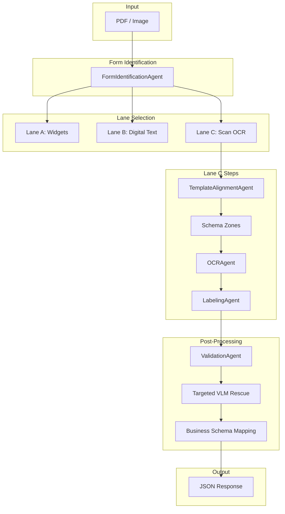
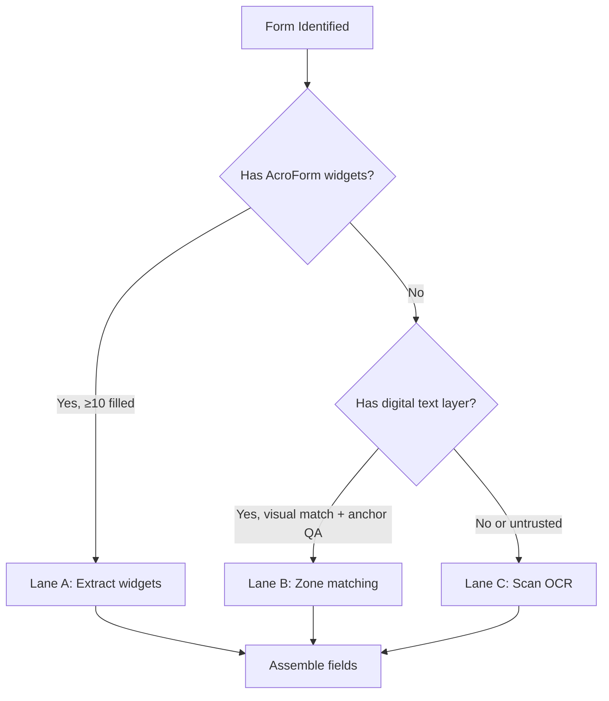
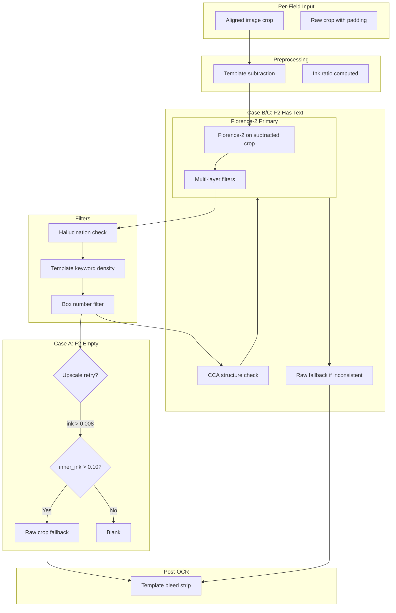
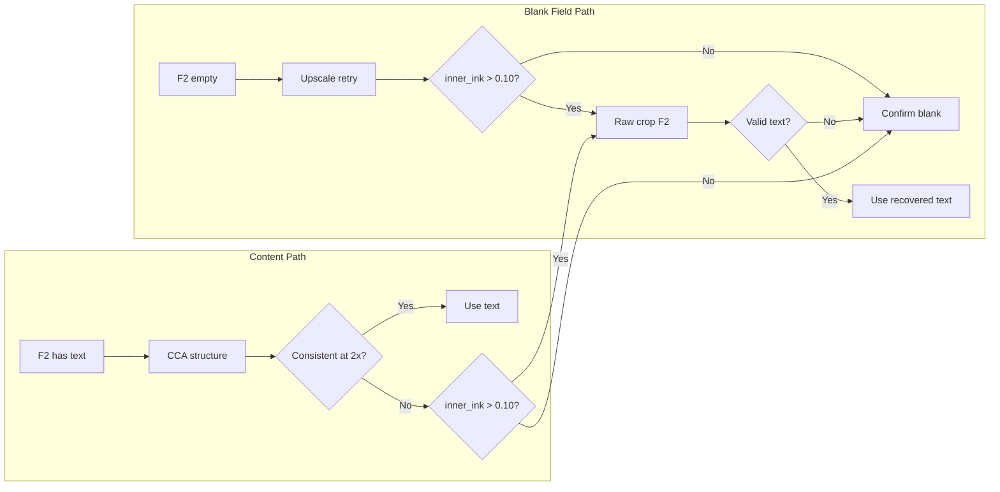

# Pipeline Overview — Doc2Data Architecture and Implementation

**Last updated:** March 2026

This document describes the Doc2Data extraction pipeline: architecture, execution flow, script responsibilities, and implementation details. It maps directly to the active codebase.

---

## Table of Contents

1. [High-Level Architecture](#1-high-level-architecture)
2. [End-to-End Flow (Mermaid)](#2-end-to-end-flow-mermaid)
3. [Three-Lane Extraction](#3-three-lane-extraction)
4. [Lane C: Scan OCR Pipeline](#4-lane-c-scan-ocr-pipeline)
5. [Script-to-Function Mapping](#5-script-to-function-mapping)
6. [Models and Configuration](#6-models-and-configuration)
7. [Operational Scripts](#7-operational-scripts)

---

## 1. High-Level Architecture

```
PDF/Image → Form ID → [Lane A | Lane B | Lane C] → Layout → OCR → Validation → JSON
```

| Stage | Component | Script |
|-------|-----------|--------|
| Entry | API / Streamlit | `app/api_main.py`, `app/streamlit_main.py` |
| Orchestrator | MultiAgentPipeline | `src/pipelines/multi_agent_pipeline.py` |
| Form ID | FormIdentificationAgent | `src/pipelines/agents/form_identification.py` |
| Alignment | TemplateAlignmentAgent | `src/pipelines/agents/template_alignment.py` |
| Registration | CMS1500 Registrar | `src/pipelines/registration/cms1500_register.py` |
| Layout | LayoutDetectionAgent | `src/pipelines/agents/layout_detection.py` |
| OCR | OCRAgent | `src/pipelines/agents/ocr.py` |
| Labeling | LabelingAgent | `src/pipelines/agents/labeling.py` |
| Validation | ValidationAgent | `src/pipelines/validators/validation.py` |
| Business Mapping | map_to_business_schema | `src/pipelines/schemas/business_schema.py` |

---

## 2. End-to-End Flow (Mermaid)

### 2.1 Top-Level Pipeline



### 2.2 Lane Selection Decision



### 2.3 CMS-1500 OCR Field Pipeline (Lane C)



### 2.4 Blank Detection and Recovery Logic



---

## 3. Three-Lane Extraction

| Lane | Trigger | Script / Method | Purpose |
|------|---------|-----------------|---------|
| **A** | Fillable PDF, ≥10 widgets filled (CMS) | `_extract_widgets`, `_map_widgets_to_schema` | `multi_agent_pipeline.py` | Direct widget value extraction, no OCR |
| **B** | Digital text layer present, visual trust + anchor QA | `_extract_pdf_digital_words`, `_match_ocr_to_zones` | `multi_agent_pipeline.py` | Zone matching against embedded text |
| **C** | Scan, no trusted text layer | `TemplateAlignmentAgent`, `OCRAgent` | `template_alignment.py`, `ocr.py` | Template alignment + per-field OCR |

---

## 4. Lane C: Scan OCR Pipeline

### 4.1 Alignment

| Step | Script | Function | Description |
|------|--------|----------|-------------|
| 1 | `template_alignment.py` | `TemplateAlignmentAgent.process` | Orchestrates alignment |
| 2 | `cms1500_register.py` | `CMS1500Registrar.register` | Dropout-red mask, AKAZE/ORB, RANSAC homography |
| 3 | `cms1500_register.py` | Quad fallback | When feature matching is weak |

### 4.2 Zone Loading

| Step | Script | Function | Description |
|------|--------|----------|-------------|
| 1 | `multi_agent_pipeline.py` | `_load_schema_zones` | Loads `bbox_norm_new` from schema |
| 2 | `multi_agent_pipeline.py` | Zone padding | `zone_padding_px`, `zone_padding_ratio` |
| 3 | `multi_agent_pipeline.py` | Mode filter | Honors `scan`, `digital`, `both` |

### 4.3 OCR Block Routing (`ocr.py`)

| Block Type | Script | Function | Behavior |
|------------|--------|----------|----------|
| CHECKBOX | `ocr.py` | `_detect_checkbox` | Template subtract → fill-ratio |
| SIGNATURE | `ocr.py` | `_process_impl` | Ink only → `[SIGNED]` or blank |
| DATE | `ocr.py` | `_process_date_field_vlm` | Florence-2 + VLM rescue for incomplete |
| TEXT/ADDRESS/NUMERIC | `ocr.py` | `_process_cms_field` | Florence-2 pipeline (see 2.3) |
| TABLE | `labeling.py` | `process_table` | VLM direct (Box 24) |

### 4.4 CMS Field OCR Details (`ocr.py`)

| Component | Function | Role |
|-----------|----------|------|
| Template subtraction | `_template_subtract`, `_template_diff_crop` | Removes pre-printed template from crop |
| Florence-2 primary | `_florence2_ocr` | Runs `<OCR>` task on subtracted crop |
| Hallucination filter | `_is_hallucination` | Rejects garbled/repeated text |
| Template keyword filter | `_CMS_TEMPLATE_KEYWORDS`, density check | Blanks when keywords > 50% of text |
| Box number filter | Regex `^\d{1,3}[a-z]?\.?$` | Catches template labels like "23" |
| Raw crop fallback | `_florence2_raw_fallback` | Florence-2 on original crop when template subtraction damages content |
| Inner ink gate | `inner_ink > 0.10` | Uses center 70% of crop to avoid padding bleed |
| Template bleed strip | `_strip_template_bleed` | Removes CARRIER, PICA, etc. from final text |

### 4.5 Table Extraction (`labeling.py`)

| Step | Function | Description |
|------|----------|-------------|
| 1 | `process_table` | Receives Box 24 crop |
| 2 | `_call_vlm` | MiniCPM-o4.5 (primary), temperature=0.0 |
| 3 | Parse | Pipe-separated or JSON-like rows |
| 4 | Deduplication | By `(cpt_code, charges)` |
| 5 | Fallback | `_extract_service_lines_ocr` if VLM returns no rows |

---

## 5. Script-to-Function Mapping

### 5.1 `src/pipelines/multi_agent_pipeline.py`

| Function | Purpose |
|----------|---------|
| `process`, `process_sync` | Main entry points |
| `_load_image` | PDF page render at 300 DPI |
| `_extract_widgets` | Lane A: read AcroForm values |
| `_map_widgets_to_schema` | Lane A: map to schema IDs |
| `_extract_pdf_digital_words` | Lane B: get text layer words |
| `_match_ocr_to_zones` | Lane B/C: match words to schema zones |
| `_load_schema_zones` | Load bbox from schema JSON |
| `_apply_targeted_vlm_rescue` | Post-validation rescue for bad fields |
| `_to_reducto_format` | Reducto-style JSON export |

### 5.2 `src/pipelines/agents/ocr.py`

| Function | Purpose |
|----------|---------|
| `process_blocks` | Batch OCR with parallelism, checkbox resolution |
| `_process_impl` | Block-type routing (checkbox/signature/date/text) |
| `_process_cms_field` | CMS text/address/numeric field pipeline |
| `_process_date_field_vlm` | Date fields with VLM rescue |
| `_florence2_ocr` | Florence-2 on crop with filters |
| `_florence2_raw_fallback` | Florence-2 on raw crop for recovery |
| `_strip_template_bleed` | Remove CARRIER, PICA, etc. from output |
| `_is_hallucination` | Reject nonsensical OCR output |
| `_is_vlm_template_text` | Density-based template text detection |
| `_has_meaningful_content` | CCA structure check |
| `_detect_checkbox` | Fill-ratio after template subtract |
| `_template_subtract` | Pixel diff with template |
| `_llm_normalize_field` | Digit/date normalization |
| `_validate_field_regex` | Field-type regex validation |
| `_compute_composite_confidence` | Combined confidence score |

### 5.3 `src/pipelines/agents/labeling.py`

| Function | Purpose |
|----------|---------|
| `process_table` | Box 24 VLM extraction |
| `_call_vlm` | Ollama VLM with image |
| `_call_slm` | Ollama SLM for text labeling |
| `_extract_service_lines_ocr` | Fallback when VLM returns no rows |

### 5.4 `src/pipelines/registration/cms1500_register.py`

| Function | Purpose |
|----------|---------|
| `register` | Align scan to template |
| `_build_dropout_red_mask` | Remove red template for matching |
| `_detect_and_match` | AKAZE/ORB + RANSAC |
| `_quad_fallback` | When feature path is weak |

### 5.5 `src/pipelines/validators/validation.py`

| Component | Purpose |
|-----------|---------|
| `validate_field` | Run validator by type |
| Validators | NPI, ICD, HCPCS, date, phone, SSN, zip, money, tax_id |
| `ValidationAgent.process` | Run over all blocks |

### 5.6 `src/pipelines/schemas/business_schema.py`

| Function | Purpose |
|----------|---------|
| `map_to_business_schema` | Schema ID → business keys |
| `merge_business_with_ocr` | Merge business + raw OCR |

---

## 6. Models and Configuration

| Purpose | Model | Config / Location |
|---------|-------|-------------------|
| Primary OCR (CMS) | Florence-2-large | HuggingFace `florence-community/Florence-2-large` |
| Table extraction | MiniCPM-o4.5 | `VLM_MODEL_TABLE` |
| Table fallback | MiniCPM-V | `VLM_MODEL_TABLE_FALLBACK` |
| VLM rescue | MiniCPM-V | `VLM_MODEL_RESCUE` |
| Printed text (general) | PaddleOCR | PaddlePaddle |
| Handwriting (optional) | TrOCR-large | HuggingFace |
| Layout (optional) | YOLOv8 | `YOLO_MODEL_PATH` |

---

## 7. Operational Scripts

| Script | Purpose |
|--------|---------|
| `scripts/test_pipeline.py` | End-to-end smoke test |
| `scripts/grade_extraction.py` | Compare predictions vs gold labels |
| `scripts/debug_cms1500_alignment.py` | Single-file alignment diagnostics |
| `scripts/tune_cms1500_thresholds.py` | Registrar threshold grid search |
| `scripts/recompute_thresholds.py` | Threshold suggestions from corrections |
| `scripts/api_client.py` | CLI client for REST API |
| `deploy_and_run.sh` | DGX deployment (rsync + Docker) |

---

## Schema Notes

- **CMS-1500** (`data/schemas/cms-1500.json`): 86 fields, `bbox_norm_new` preferred
- **UB-04** (`data/schemas/ub-04.json`): 98 fields, widget + zone mapping

---

*This document reflects the codebase as of March 2026.*
