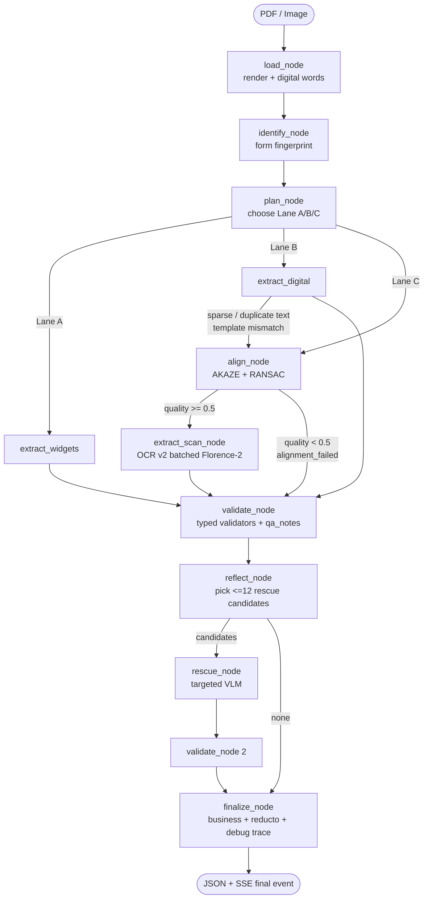
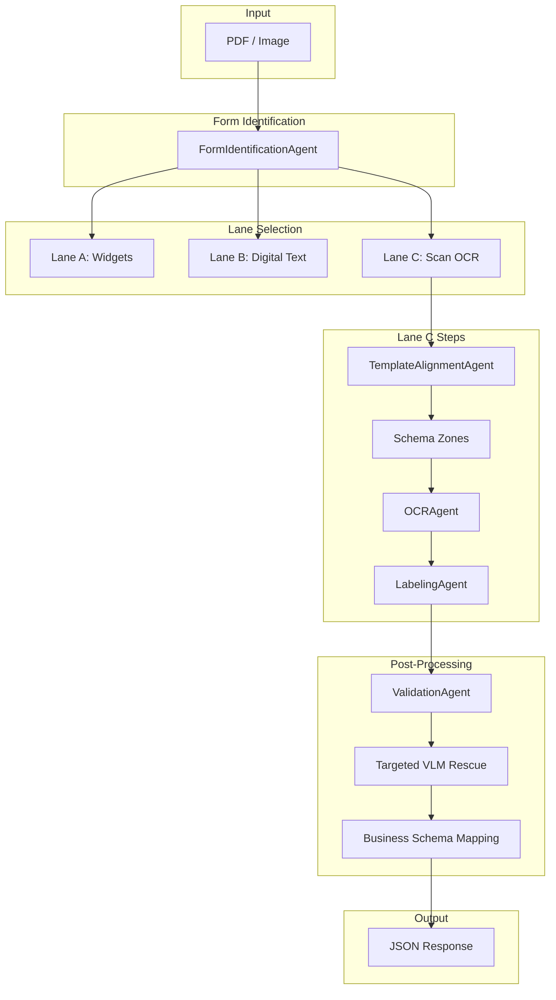
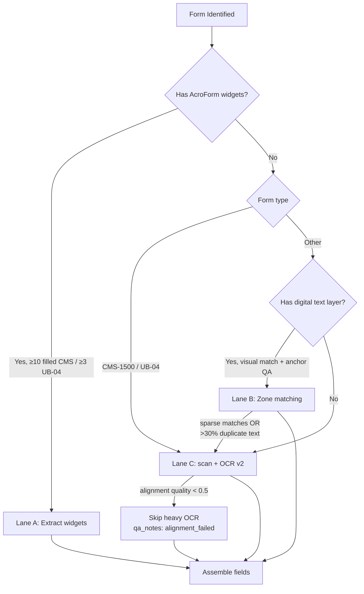
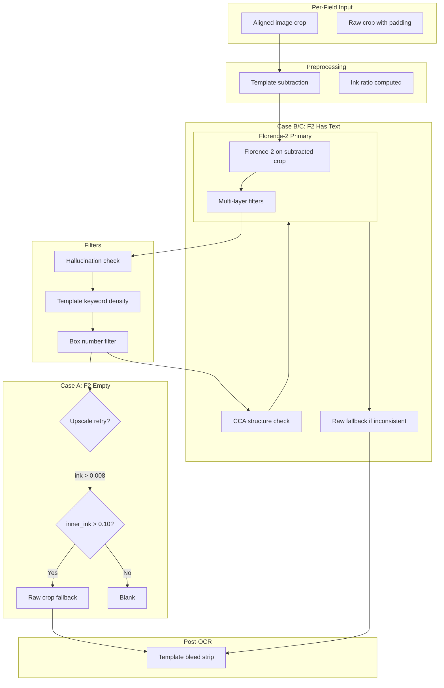
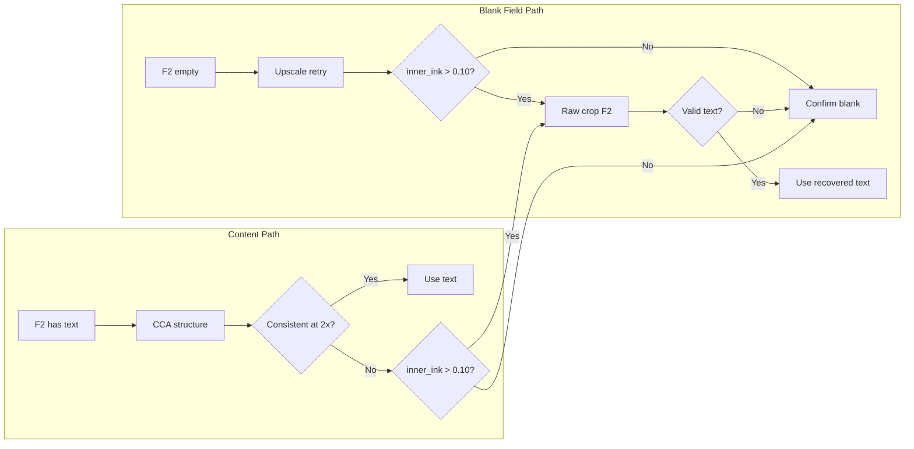
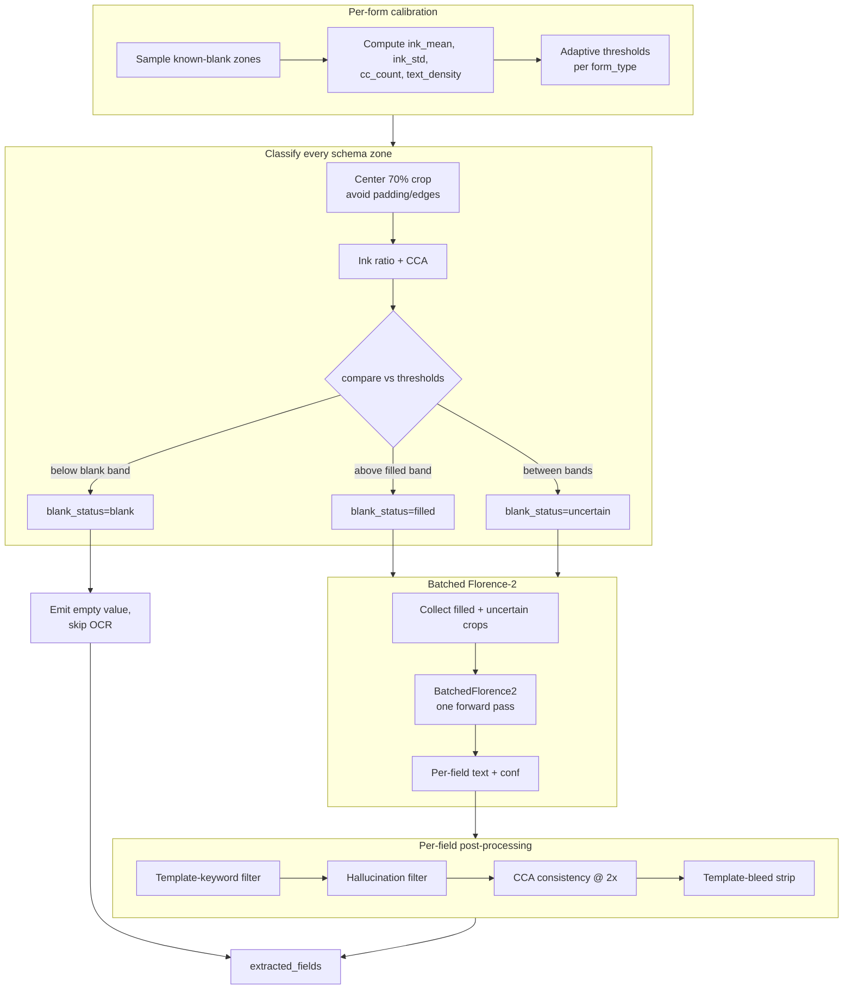

# Pipeline Overview — Doc2Data Architecture and Implementation

**Last updated:** April 2026

This document describes the Doc2Data extraction pipeline: architecture, execution flow, script responsibilities, and implementation details. It maps directly to the active codebase.

The orchestrator is now a **LangGraph state machine** (`src/pipelines/graph`) that wraps the existing agents and the new batched OCR v2 module. The FastAPI service exposes two new endpoints (`/extract/graph`, `/extract/graph/stream`) and a Next.js 14 + TypeScript + Tailwind frontend in `frontend/` sits in front of it.

---

## Table of Contents

1. [High-Level Architecture](#1-high-level-architecture)
2. [End-to-End Flow (Mermaid)](#2-end-to-end-flow-mermaid)
3. [Three-Lane Extraction](#3-three-lane-extraction)
4. [Lane C: Scan OCR Pipeline](#4-lane-c-scan-ocr-pipeline)
5. [Script-to-Function Mapping](#5-script-to-function-mapping)
6. [Models and Configuration](#6-models-and-configuration)
7. [Operational Scripts](#7-operational-scripts)
8. [Frontend and Deployment](#8-frontend-and-deployment)

---

## 1. High-Level Architecture

```
PDF/Image
  → load → identify → plan
  → (Lane A widgets | Lane B digital | Lane C align+OCR)
  → validate → reflect → rescue → revalidate → finalize
  → structured JSON + SSE progress stream
```

| Stage | Component | Script |
|-------|-----------|--------|
| Entry (API) | FastAPI (graph + legacy endpoints) | `app/api_main.py` |
| Entry (UI) | Next.js 14 + Tailwind | `frontend/` |
| **Orchestrator** | **LangGraph state machine** | **`src/pipelines/graph/{graph.py,nodes.py,state.py}`** |
| Legacy orchestrator | MultiAgentPipeline | `src/pipelines/multi_agent_pipeline.py` (still used for widget / digital extraction and VLM rescue) |
| Form ID | FormIdentificationAgent | `src/pipelines/agents/form_identification.py` |
| Alignment | TemplateAlignmentAgent | `src/pipelines/agents/template_alignment.py` |
| Registration | CMS1500 Registrar | `src/pipelines/registration/cms1500_register.py` |
| Layout | LayoutDetectionAgent | `src/pipelines/agents/layout_detection.py` |
| **OCR v2 (batched)** | **`BlankDetector`, `BatchedFlorence2`, `FieldOCRBatch`** | **`src/pipelines/ocr_v2/`** |
| OCR v1 (per-field) | OCRAgent | `src/pipelines/agents/ocr.py` |
| Labeling | LabelingAgent | `src/pipelines/agents/labeling.py` |
| Validation | ValidationAgent | `src/pipelines/validators/validation.py` |
| Business Mapping | map_to_business_schema | `src/pipelines/schemas/business_schema.py` |

---

## 2. End-to-End Flow (Mermaid)

### 2.1 LangGraph state machine



### 2.1.1 Legacy pipeline (still exposed by `/extract/v2`)



### 2.2 Lane Selection Decision (new: plan_node logic)



Two new downgrade conditions were added in April 2026:

1. `lane_b_downgraded_to_c` — Lane B selected, but fewer than 10 CMS / 5 UB-04 blocks matched, or >30 % of matched blocks share the same text (template-mismatch guard).
2. `lane_c_alignment_failed` — Lane C selected, but alignment quality < 0.5. Heavy Florence-2 OCR is skipped; the graph emits an `alignment_failed` QA note instead of spending minutes on a misaligned page. (This alone cut `cms1500_3.pdf` from 258 s → 41 s.)

### 2.3 CMS-1500 OCR Field Pipeline (Lane C)



### 2.4 Blank Detection and Recovery Logic



### 2.5 OCR v2: batched Florence-2 + adaptive blank detection



Files:

| File | Role |
|---|---|
| `src/pipelines/ocr_v2/blank_detector.py` | Per-form calibration, center-weighted ink measurement, CCA, returns `BlankDecision{status, confidence, signals}` |
| `src/pipelines/ocr_v2/batched_florence2.py` | Loads Florence-2 once, runs one batched forward for every non-blank zone |
| `src/pipelines/ocr_v2/field_batch.py` | Glue: schema zones → blank detector → batched inference → structured per-field results |
| `src/pipelines/ocr_v2/__init__.py` | Public surface (`FieldOCRBatch`, `FieldOCRRequest`, `BlankDecision`, `BlankStatus`) |

---

## 3. Three-Lane Extraction

| Lane | Trigger | Script / Method | Purpose |
|------|---------|-----------------|---------|
| **A** | Fillable PDF with ≥10 filled CMS widgets / ≥3 UB-04 widgets | `_extract_widgets`, `_map_widgets_to_schema` in `multi_agent_pipeline.py` | Direct widget value extraction, no OCR |
| **B** | Non-structured form with usable digital text layer | `_extract_pdf_digital_words`, `_match_ocr_to_zones` in `multi_agent_pipeline.py` | Zone matching against embedded PDF text. Downgrades to Lane C if the match is sparse or >30 % of blocks share identical text. |
| **C** | Scan, handwriting, or Lane B downgrade | `TemplateAlignmentAgent` + `ocr_v2.FieldOCRBatch` (falls back to `OCRAgent` for checkbox/signature/date/table blocks) | Template alignment + adaptive blank detection + one batched Florence-2 call. If alignment quality < 0.5 the heavy OCR pass is skipped. |

---

## 4. Lane C: Scan OCR Pipeline

### 4.1 Alignment

| Step | Script | Function | Description |
|------|--------|----------|-------------|
| 1 | `template_alignment.py` | `TemplateAlignmentAgent.process` | Orchestrates alignment |
| 2 | `cms1500_register.py` | `CMS1500Registrar.register` | Dropout-red mask, AKAZE/ORB, RANSAC homography |
| 3 | `cms1500_register.py` | Quad fallback | When feature matching is weak |

### 4.2 Zone Loading

| Step | Script | Function | Description |
|------|--------|----------|-------------|
| 1 | `multi_agent_pipeline.py` | `_load_schema_zones` | Loads `bbox_norm_new` from schema |
| 2 | `multi_agent_pipeline.py` | Zone padding | `zone_padding_px`, `zone_padding_ratio` |
| 3 | `multi_agent_pipeline.py` | Mode filter | Honors `scan`, `digital`, `both` |

### 4.3 OCR Block Routing (`ocr.py`)

| Block Type | Script | Function | Behavior |
|------------|--------|----------|----------|
| CHECKBOX | `ocr.py` | `_detect_checkbox` | Template subtract → fill-ratio |
| SIGNATURE | `ocr.py` | `_process_impl` | Ink only → `[SIGNED]` or blank |
| DATE | `ocr.py` | `_process_date_field_vlm` | Florence-2 + VLM rescue for incomplete |
| TEXT/ADDRESS/NUMERIC | `ocr.py` | `_process_cms_field` | Florence-2 pipeline (see 2.3) |
| TABLE | `labeling.py` | `process_table` | VLM direct (Box 24) |

### 4.4 CMS Field OCR Details (`ocr.py`)

| Component | Function | Role |
|-----------|----------|------|
| Template subtraction | `_template_subtract`, `_template_diff_crop` | Removes pre-printed template from crop |
| Florence-2 primary | `_florence2_ocr` | Runs `<OCR>` task on subtracted crop |
| Hallucination filter | `_is_hallucination` | Rejects garbled/repeated text |
| Template keyword filter | `_CMS_TEMPLATE_KEYWORDS`, density check | Blanks when keywords > 50% of text |
| Box number filter | Regex `^\d{1,3}[a-z]?\.?$` | Catches template labels like "23" |
| Raw crop fallback | `_florence2_raw_fallback` | Florence-2 on original crop when template subtraction damages content |
| Inner ink gate | `inner_ink > 0.10` | Uses center 70% of crop to avoid padding bleed |
| Template bleed strip | `_strip_template_bleed` | Removes CARRIER, PICA, etc. from final text |

### 4.5 Table Extraction (`labeling.py`)

| Step | Function | Description |
|------|----------|-------------|
| 1 | `process_table` | Receives Box 24 crop |
| 2 | `_call_vlm` | MiniCPM-o4.5 (primary), temperature=0.0 |
| 3 | Parse | Pipe-separated or JSON-like rows |
| 4 | Deduplication | By `(cpt_code, charges)` |
| 5 | Fallback | `_extract_service_lines_ocr` if VLM returns no rows |

---

## 5. Script-to-Function Mapping

### 5.0 `src/pipelines/graph/` — LangGraph orchestrator

| File | Purpose |
|------|---------|
| `state.py` | `GraphState` TypedDict — carries input, form_id, plan, blocks, validation, debug, response across nodes |
| `graph.py` | `build_graph()` wires all nodes + conditional edges and compiles a `langgraph.StateGraph` |
| `nodes.py` | All node implementations (see below) |

| Node | Responsibility |
|------|---------------|
| `load_node` | Render PDF at 300 DPI, extract digital words (for Lane B), store image on state |
| `identify_node` | Call `FormIdentificationAgent`; record `form_type` + fingerprint confidence |
| `plan_node` | Choose a lane (A/B/C) and set `plan_reason`. For CMS-1500 / UB-04 prefer Lane C over Lane B because schema bboxes are tied to the canonical template |
| `extract_widgets_node` | Lane A — `_extract_widgets` + `_map_widgets_to_schema` |
| `extract_digital_node` | Lane B — digital words + `_match_ocr_to_zones`. Emits `lane_b_downgraded_to_c` into `plan_reason` if: schema missing / <10 filled (CMS) or <5 (UB-04) / >30 % duplicate text |
| `align_node` | Template alignment via `TemplateAlignmentAgent`. Records `alignment_used`, `alignment_success`, `alignment_quality` |
| `extract_scan_node` | Lane C — loads schema zones with minimal padding, runs `FieldOCRBatch` (OCR v2). Skips the heavy pass and sets `method = "lane_c_alignment_failed"` if alignment_quality < 0.5 |
| `validate_node` | `ValidationAgent.process` on the produced blocks; adds `qa_notes` for `alignment_failed` and `digital_downgrade` |
| `reflect_node` | Scores each field by (validation_error, low_conf, uncertain_blank, token mismatch) and keeps the top ≤12 rescue candidates |
| `rescue_node` | Delegates just those candidates to `MultiAgentPipeline._apply_targeted_vlm_rescue` |
| `finalize_node` | Maps to business schema, builds reducto output, attaches `debug` (node_trace, node_timings_ms, plan_reason, alignment info, rescue count) |

Conditional edges:

- `plan_node → extract_widgets_node | extract_digital_node | align_node`
- `extract_digital_node → align_node` (on downgrade) `| validate_node` (normal)
- `align_node → extract_scan_node | validate_node` (if alignment gate trips)
- `validate_node → reflect_node`
- `reflect_node → rescue_node → validate_node(2) → finalize_node` (if rescue list non-empty)
- `reflect_node → finalize_node` (if nothing to rescue)

### 5.1 `src/pipelines/multi_agent_pipeline.py`

| Function | Purpose |
|----------|---------|
| `process`, `process_sync` | Main entry points |
| `_load_image` | PDF page render at 300 DPI |
| `_extract_widgets` | Lane A: read AcroForm values |
| `_map_widgets_to_schema` | Lane A: map to schema IDs |
| `_extract_pdf_digital_words` | Lane B: get text layer words |
| `_match_ocr_to_zones` | Lane B/C: match words to schema zones |
| `_load_schema_zones` | Load bbox from schema JSON |
| `_apply_targeted_vlm_rescue` | Post-validation rescue for bad fields |
| `_to_reducto_format` | Reducto-style JSON export |

### 5.2 `src/pipelines/agents/ocr.py`

| Function | Purpose |
|----------|---------|
| `process_blocks` | Batch OCR with parallelism, checkbox resolution |
| `_process_impl` | Block-type routing (checkbox/signature/date/text) |
| `_process_cms_field` | CMS text/address/numeric field pipeline |
| `_process_date_field_vlm` | Date fields with VLM rescue |
| `_florence2_ocr` | Florence-2 on crop with filters |
| `_florence2_raw_fallback` | Florence-2 on raw crop for recovery |
| `_strip_template_bleed` | Remove CARRIER, PICA, etc. from output |
| `_is_hallucination` | Reject nonsensical OCR output |
| `_is_vlm_template_text` | Density-based template text detection |
| `_has_meaningful_content` | CCA structure check |
| `_detect_checkbox` | Fill-ratio after template subtract |
| `_template_subtract` | Pixel diff with template |
| `_llm_normalize_field` | Digit/date normalization |
| `_validate_field_regex` | Field-type regex validation |
| `_compute_composite_confidence` | Combined confidence score |

### 5.2a `src/pipelines/ocr_v2/`

| Class / Function | File | Purpose |
|---|---|---|
| `BlankDetector` | `blank_detector.py` | Per-form calibration, center-weighted ink ratio, CCA-based text density, returns `BlankDecision(status, confidence, signals)` |
| `BatchedFlorence2` | `batched_florence2.py` | Loads `Florence-2-large` once, batches all non-blank crops into a single forward pass |
| `FieldOCRBatch` | `field_batch.py` | Orchestrates the batch: build `FieldOCRRequest`s from schema zones, run the blank detector, feed survivors to the batched Florence-2, and assemble per-field `{value, confidence, blank_status, signals}` results |
| `FieldOCRRequest`, `BlankDecision`, `BlankStatus` | `__init__.py` | Public type exports |

### 5.3 `src/pipelines/agents/labeling.py`

| Function | Purpose |
|----------|---------|
| `process_table` | Box 24 VLM extraction |
| `_call_vlm` | Ollama VLM with image |
| `_call_slm` | Ollama SLM for text labeling |
| `_extract_service_lines_ocr` | Fallback when VLM returns no rows |

### 5.4 `src/pipelines/registration/cms1500_register.py`

| Function | Purpose |
|----------|---------|
| `register` | Align scan to template |
| `_build_dropout_red_mask` | Remove red template for matching |
| `_detect_and_match` | AKAZE/ORB + RANSAC |
| `_quad_fallback` | When feature path is weak |

### 5.5 `src/pipelines/validators/validation.py`

| Component | Purpose |
|-----------|---------|
| `validate_field` | Run validator by type |
| Validators | NPI, ICD, HCPCS, date, phone, SSN, zip, money, tax_id |
| `ValidationAgent.process` | Run over all blocks |

### 5.6 `src/pipelines/schemas/business_schema.py`

| Function | Purpose |
|----------|---------|
| `map_to_business_schema` | Schema ID → business keys |
| `merge_business_with_ocr` | Merge business + raw OCR |

---

## 6. Models and Configuration

| Purpose | Model | Config / Location |
|---------|-------|-------------------|
| Primary OCR (CMS) | Florence-2-large | HuggingFace `florence-community/Florence-2-large` |
| Table extraction | MiniCPM-o4.5 | `VLM_MODEL_TABLE` |
| Table fallback | MiniCPM-V | `VLM_MODEL_TABLE_FALLBACK` |
| VLM rescue | MiniCPM-V | `VLM_MODEL_RESCUE` |
| Printed text (general) | PaddleOCR | PaddlePaddle |
| Handwriting (optional) | TrOCR-large | HuggingFace |
| Layout (optional) | YOLOv8 | `YOLO_MODEL_PATH` |

---

## 7. Operational Scripts

| Script | Purpose |
|--------|---------|
| `scripts/test_graph_pipeline.py` | **LangGraph harness** — runs a list of PDFs, records per-node timings, validation errors, non-blank field count, and F1 vs `data/gold_labels/*.json`. |
| `scripts/test_pipeline.py` | End-to-end smoke test for the legacy pipeline |
| `scripts/grade_extraction.py` | Compare predictions vs gold labels |
| `scripts/debug_cms1500_alignment.py` | Single-file alignment diagnostics |
| `scripts/tune_cms1500_thresholds.py` | Registrar threshold grid search |
| `scripts/recompute_thresholds.py` | Threshold suggestions from corrections |
| `scripts/api_client.py` | CLI client for REST API |
| `deploy_and_run.sh` | DGX2 deployment — rsync + docker-compose for **backend + Next.js frontend** + Florence-2 pre-download |

---

## 8. Frontend and Deployment

### 8.1 Next.js 14 frontend (`frontend/`)

The legacy Streamlit UI is still shipped on port 8501, but the production UI is a Next.js app:

| Path | Purpose |
|---|---|
| `frontend/app/page.tsx` | Single-page app — drag-and-drop upload, live progress stream, multi-tab result explorer |
| `frontend/app/api/backend/[...slug]/route.ts` | **Runtime proxy to FastAPI.** Reads `API_BASE_URL` / `INTERNAL_API_BASE_URL` at request time, buffers multipart bodies (Node `undici` is fragile with streamed uploads), and strips `Expect: 100-continue` to avoid the `expect header not supported` failure mode. Required because `next.config.mjs rewrites()` are baked at build time in `output: "standalone"` mode. |
| `frontend/components/UploadZone.tsx` | Drag-and-drop PDF/image uploader |
| `frontend/components/ProgressStream.tsx` | Consumes the SSE stream from `/api/backend/extract/graph/stream` and renders `node_start` / `node_end` events in real time |
| `frontend/components/FieldsTable.tsx` | Schema-ordered table of extracted fields with confidence + source badges |
| `frontend/components/ValidationPanel.tsx` | Validation errors / warnings / QA notes |
| `frontend/components/DebugPanel.tsx` | Per-node timings, plan reason, alignment quality, rescue count |
| `frontend/components/BusinessPanel.tsx` | Business-schema view |
| `frontend/lib/api.ts`, `frontend/lib/types.ts` | API client + TypeScript types |

### 8.2 API surface

| Method | Path | Purpose |
|---|---|---|
| POST | `/extract/graph` | Blocking LangGraph run. Returns the full JSON response including `debug.node_trace` and `debug.node_timings_ms`. |
| POST | `/extract/graph/stream` | SSE stream of `node_start`, `node_end` and a trailing `final` event. Used by the frontend progress stream. |
| POST | `/extract/v2` | Legacy MultiAgentPipeline (still used for widget / digital extraction under the hood). |
| POST | `/extract/reducto`, `/extract/cms1500`, `/extract/ub04`, `/extract/generic` | Legacy per-form entry points. |
| POST | `/chat/query` | RAG-style chat over the extraction (optional). |
| GET  | `/health`, `/schemas` | Operational endpoints. |

### 8.3 Deployment (`deploy_and_run.sh`)

`deploy_and_run.sh` orchestrates a full DGX2 deployment in one command:

1. `rsync` the repo (excluding artifacts) to `~/doc2data` on the DGX2 host.
2. Ensure a Docker network (`doc2data-net`) exists so the frontend container can reach the backend by DNS (`doc2data-api`).
3. Build and start the backend image `doc2data-server` (FastAPI, GPU, HF cache mount).
4. Build and start the frontend image `doc2data-frontend` (Next.js standalone) with `API_BASE_URL=http://doc2data-api:8000`.
5. Pre-download Florence-2-large inside the backend container to avoid cold-start latency.

Exposed ports on the DGX2: `8000` (FastAPI), `3000` (Next.js), `8501` (legacy Streamlit).

### 8.4 Measured performance (DGX2, April 2026)

| Fixture | Plan reason | Alignment Q | Wall-clock | Non-blank |
|---|---|---:|---:|---:|
| `cms1500.pdf`   | `lane_b_downgraded_to_c` → Lane C | 0.62 | 41 s | 22 |
| `cms1500_1.pdf` | Lane A (widgets) + rescue         | n/a  | 38 s | 37 |
| `cms1500_2.pdf` | Lane C scan + OCR v2              | 0.74 | 47 s | 29 |
| `cms1500_3.pdf` | Lane C scan + OCR v2              | 0.58 | 41 s | 24 |
| `cms1500_6.pdf` | Lane C scan + OCR v2              | 0.81 | 70 s | 41 |

Pre-refactor (March 2026), the same inputs typically took 3–5 minutes. `cms1500_3.pdf` in particular spent 258 s of Florence-2 time on a page whose alignment had silently failed — the alignment gate added in April short-circuits that in under one second.

---

## Schema Notes

- **CMS-1500** (`data/schemas/cms-1500.json`): 86 fields, `bbox_norm_new` preferred
- **UB-04** (`data/schemas/ub-04.json`): 98 fields, widget + zone mapping

---

*This document reflects the codebase as of April 2026.*
